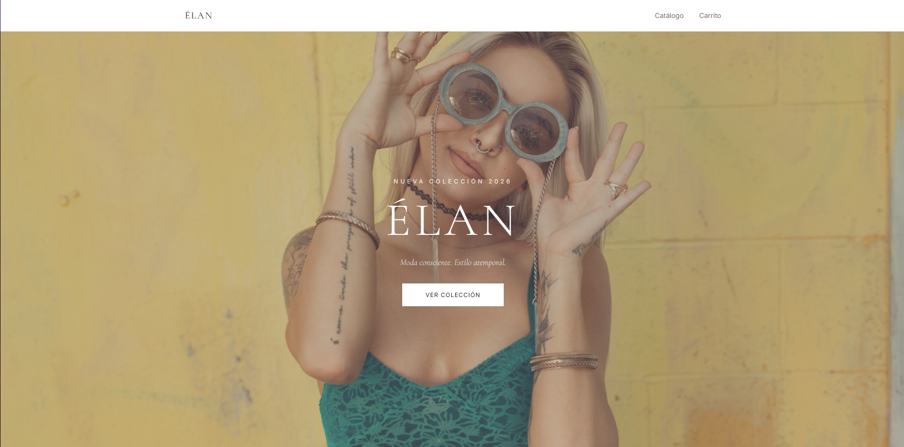
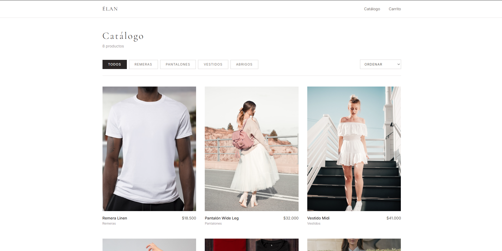
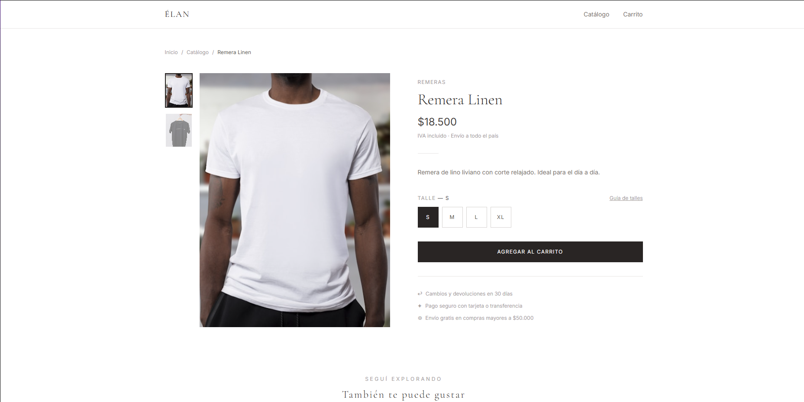

# ÉLAN — Tienda de indumentaria

Tienda de ropa femenina desarrollada con React. Proyecto de portfolio que simula un e-commerce real con catálogo, carrito y checkout.

🔗 [Ver demo en vivo](https://elan-store-tan.vercel.app)

---

## Funcionalidades

- Catálogo con filtros por categoría y ordenamiento por precio
- Hover en cards muestra segunda foto del producto
- Detalle de producto con galería de imágenes y selector de talle
- Carrito persistente con manejo de cantidades
- Checkout con validación de formulario y selector de provincia/ciudad
- Pantalla de confirmación de pedido
- Diseño responsive — mobile, tablet y desktop

## Tecnologías

- React 19 + Vite
- Tailwind CSS
- Zustand (estado global del carrito)
- React Router v6

## Correr el proyecto localmente

Requisitos: Node.js v18 o superior

```bash
git clone https://github.com/brunolopezx/elan-store.git
cd elan-store
npm install
npm run dev
```

Abrir [http://localhost:5173](http://localhost:5173) en el navegador.

## Estructura del proyecto

```text
src/
├── components/    # Navbar, Footer
├── pages/         # Home, Catalog, ProductDetail, Cart, Checkout
├── store/         # Carrito con Zustand
└── data/          # Productos en JSON
```

## Capturas

<p align="center">
  
  
  
</p>